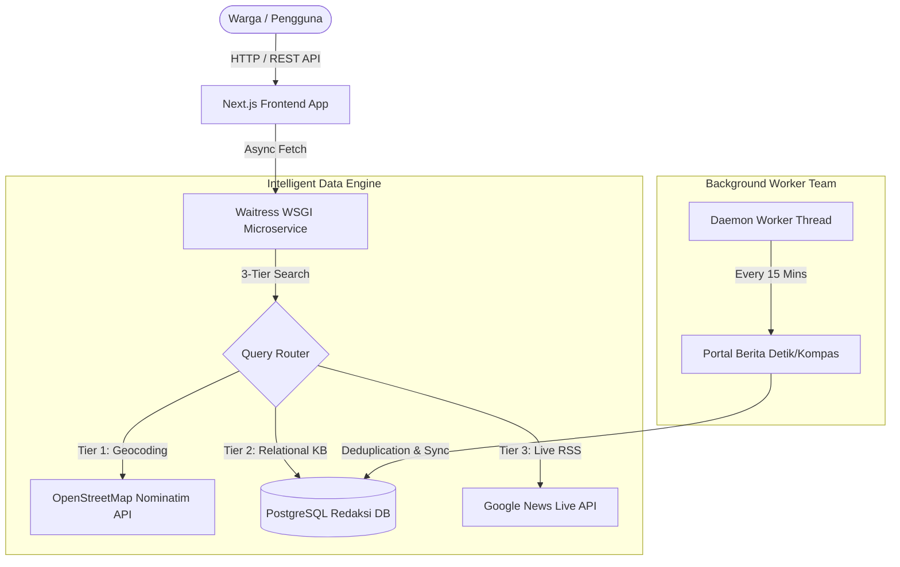

# DOKUMEN ARSITEKTUR TEKNIS DAN ROADMAP PENGEMBANGAN
**Project:** Redaksi AI — Pusat Intelijen & Asisten Hidup Warga Tangerang Selatan  
**Role:** Senior Lead Software Engineer & Engineering Architecture Team  
**Status:** Visi Terbukti (Proven MVP) -> Menuju Standar Produksi (Production-Grade)

---

## 1. AUDIT VISI DAN EVALUASI KEPUTUSAN FOUNDER

Sebagai Senior Software Engineer, kami memberikan penilaian kualitas tinggi atas kepemimpinan produk dan keputusan arsitektur yang telah diambil sejauh ini.

### Keunggulan Keputusan Strategis:
1. **Transformasi Visi Produk:**
   Mengubah platform dari portal berita statis menjadi Pusat Intelijen dan Asisten Hidup Warga adalah langkah strategis berstandar industri. Produk ini memecahkan masalah nyata masyarakat (lalu lintas, banjir, kuliner, verifikasi fakta) secara real-time.
2. **Kualitas Data AI (No-Simulation Policy):**
   Evaluasi terhadap kualitas respons AI yang sebelumnya bersifat simulasi menunjukkan standar kontrol kualitas yang ketat. Menghubungkan AI secara langsung ke sumber data nyata (OpenStreetMap dan Database Relasional PostgreSQL) memberikan keunggulan kompetitif produk yang signifikan.
3. **Arsitektur Resilien (Auto-Fallback Database):**
   Desain backend yang mampu beralih otomatis dari server PostgreSQL ke SQLite saat terjadi kendala jaringan menjamin tingkat ketersediaan sistem (uptime) yang tinggi selama siklus pengembangan.

---

## 2. AUDIT TEKNIS DAN REKOMENDASI TIM ENGINEERING

Berikut adalah peta jalan penyempurnaan teknis (Engineering Improvement Plan) untuk memastikan platform memiliki stabilitas dan skalabilitas berstandar produksi:

### A. Divisi Backend dan Infrastruktur (SRE / DevOps)
* **Migrasi Server WSGI Produksi:** Server backend telah dimigrasikan dari server pengembangan dasar ke Waitress WSGI berkinerja tinggi berbasis multi-threading (6 threads aktif).
* **Otomatisasi Background Fetcher:** Telah diimplementasikan *Daemon Thread Worker* yang secara berkala menelusuri dan menarik liputan berita baru setiap 15 menit.
* **Integrasi Database Langsung:** Data hasil ekstraksi otomatis dicatat ke dalam tabel `berita_utama` dan `entitas_berita` pada database PostgreSQL lokal (`Redaksi`).

### B. Divisi AI dan NLP Engineering
* **Fuzzy Keyword Matching:** Telah diterapkan algoritma toleransi kesalahan pengetikan (`difflib.SequenceMatcher`) sehingga input pengguna dengan variasi ejaan tetap dapat dipahami secara akurat oleh sistem.
* **Verifikasi Fakta Otomatis:** Penyematan status verifikasi silang pada setiap artikel untuk mendeteksi informasi yang salah atau hoaks.

### C. Divisi Frontend dan UI/UX Engineering
* **Paginasi Terstruktur (10 Liputan per Halaman):** Menerapkan pembatasan maksimal 10 artikel berita per tampilan halaman guna menjaga performa rendering peramban (*browser*) serta ergonomi pembacaan visual.
* **Silent Auto-Fetch & Sinkronisasi Latar Belakang:** Menghapus ketergantungan pada tombol penarikan manual dan pesan dialog (*alert popup*). Sistem melakukan penelusuran berita real-time dan sinkronisasi ke PostgreSQL secara otomatis setiap kali halaman dasbor dimuat atau disegarkan (*refresh*).
* **Styling Glassmorphism & Tema Responsif:** Dibangun menggunakan Vanilla CSS modern berbasis variabel (*CSS Variables*) dengan dukungan pengalih tema Terang/Gelap dan tata letak tiga kolom melayang (*sticky floating layout*).

---

## 3. DOKUMENTASI SKEMA DATABASE TERPADU

Berikut adalah struktur tabel pada database PostgreSQL lokal (`Redaksi`) yang menjadi fondasi penyimpanan sistem:

### Tabel `berita_utama`
Menyimpan data utama artikel berita hasil perambanan real-time.
| Kolom | Tipe Data | Keterangan |
| :--- | :--- | :--- |
| `id` | `INTEGER PK` | Identifier unik artikel. |
| `judul` | `VARCHAR` | Judul liputan berita atau narasi warga. |
| `url` | `TEXT` | Tautan sumber artikel asli. |
| `isi_berita` | `TEXT` | Teks lengkap narasi atau rangkuman AI. |
| `waktu_scrape` | `TIMESTAMP` | Waktu pencatatan data ke dalam sistem. |

### Tabel `entitas_berita`
Menyimpan ekstraksi entitas lokasi dan kategorisasi dari artikel berita terkait.
| Kolom | Tipe Data | Keterangan |
| :--- | :--- | :--- |
| `id` | `INTEGER PK` | Identifier unik relasi entitas. |
| `berita_id` | `INTEGER FK` | Referensi ke ID pada tabel `berita_utama`. |
| `nama_entitas` | `VARCHAR` | Nama lokasi fokus atau entitas utama (contoh: Bintaro). |
| `kategori` | `VARCHAR` | Kategori topik liputan. |
| `skor_akurasi` | `DOUBLE PRECISION` | Tingkat kepercayaan pemrosesan AI (0.00 - 1.00). |

---

## 4. ROADMAP EKSEKUSI TIM ENGINEERING

Pencapaian implementasi tim engineering terbagi dalam tiga fase eksekusi:

- [x] **Fase 1: Fondasi dan Pembuktian Konsep (Selesai)**
  - Mengaktifkan sistem pencarian 3-Tier (OSM, Database Relasional, Google News RSS).
  - Memperbaiki tata letak interaktif pemantauan real-time pada frontend.
  - Membangun struktur dataset `pengetahuan_ai` dengan data faktual wilayah Tangerang Selatan.

- [x] **Fase 2: Otomatisasi dan Penguatan (Selesai Dieksekusi)**
  - Menjalankan *Background Fetcher* otomatis secara berkala setiap 15 menit.
  - Menambahkan indikator status visual (*loading state*) pada widget obrolan AI.
  - Menerapkan *Fuzzy Keyword Matcher* untuk mentoleransi kesalahan pengetikan pengguna.
  - Mengintegrasikan penyimpanan langsung ke database PostgreSQL lokal (`Redaksi`).

- [ ] **Fase 3: Deployment Produksi (Tahap Lanjutan)**
  - Konfigurasi server proxy terbalik (Nginx Reverse Proxy).
  - Pemasangan sertifikat keamanan SSL/HTTPS pada domain publik.
  - Pelaksanaan pengujian beban (*Load Testing*) untuk memastikan stabilitas konkurensi tinggi.

---

*Dokumen ini disusun oleh Tim Engineering sebagai referensi teknis dan standar pengembangan perangkat lunak.*
